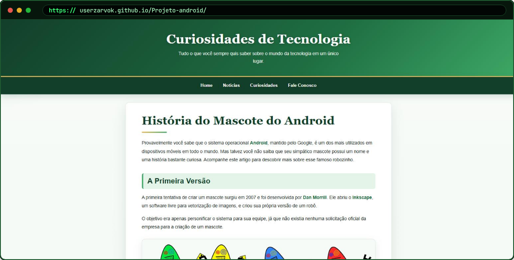

<div align="center">



<br>

<a href="https://userzarvok.github.io/Projeto-android/"></a>


</div>

**Curiosidades de Tecnologia** é uma página de artigo que conta a história do robozinho verde do Android: da primeira
versão, desenhada por Dan Morrill no Inkscape, até o mascote que todo mundo conhece.

<a href="https://userzarvok.github.io/Projeto-android/"></a>

## O que usei

- **HTML semântico**: `header`, `nav`, `main`, `article`, `aside` e `footer`;
- **imagens responsivas** com `<picture>` e vídeo do YouTube incorporado com `<iframe>` na proporção 16:9 (`aspect-ratio`);
- **CSS com variáveis** (`--gold`, `--font-title`...) para cores e fontes;
- cartões em **Grid** (`repeat(auto-fit, minmax(...))`) e alinhamentos com **Flexbox**;
- **media queries** para a página se ajustar no celular.

## Estrutura

```text
Projeto-android/
├── index.html
├── style.css
└── imagens do mascote (bugdroid.png, dan-droids.png, dan-droids-pq.png)
```

## Créditos

Texto e imagens usados para estudo. A marca Android e o robô Android pertencem ao Google; as ilustrações da primeira
versão são de Dan Morrill.

## Licença

© 2026 Pedro ([@Userzarvok](https://github.com/Userzarvok)). **Todos os direitos reservados**: você pode ver o código e o
site para estudar, mas não pode copiar nem publicar em outro lugar sem autorização. Veja o arquivo [LICENSE](LICENSE).
